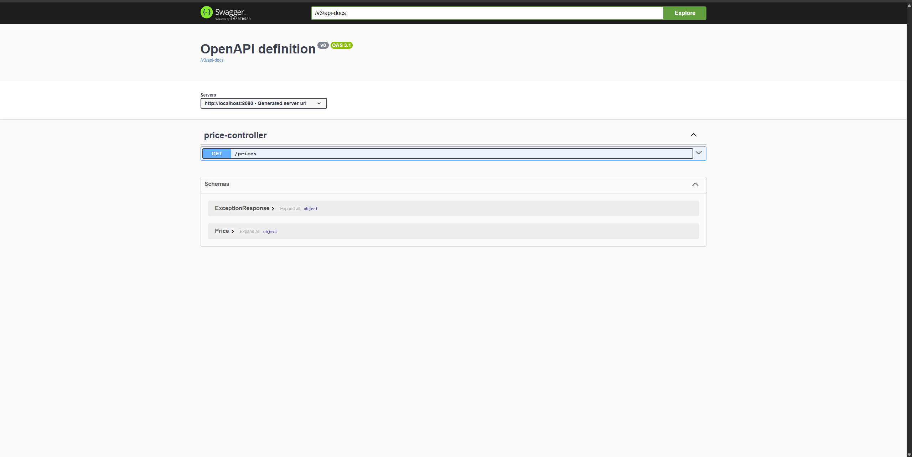
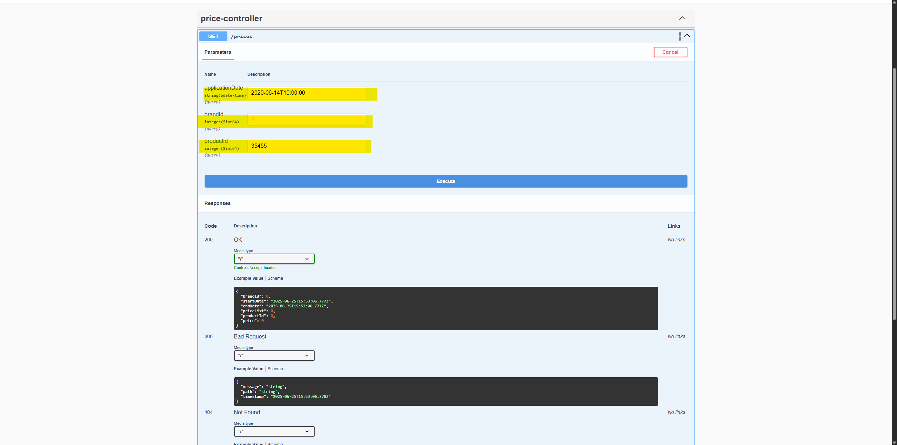
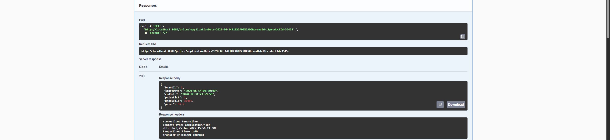
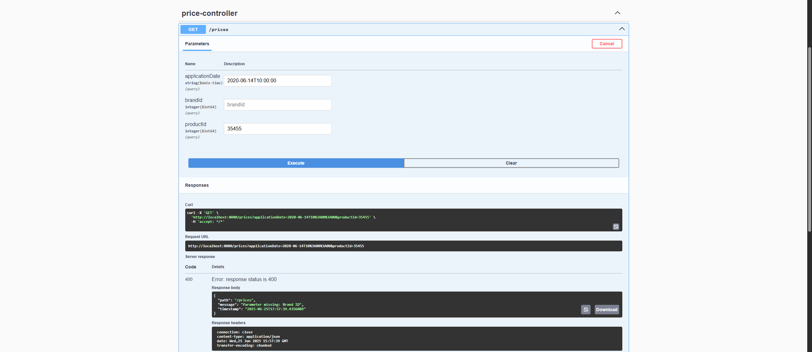
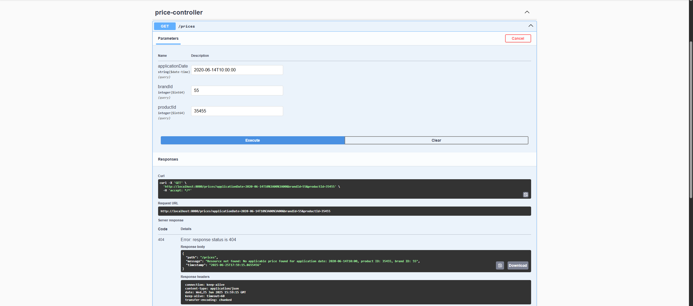

# Technical Test - Price Management

## Project Overview

Java Spring Boot application for retrieving an applicable price following the specified rules:
- Retrieving a list of all applicable prices by date, product, and brand. 
- Select the applicable price from the list by the highest priority (price_list).
- If mandatory parameters are missing, return a bad request response (400).
- If there are no applicable prices, return a not fount response (404).


## Technologies Used

- Java 24
- Spring Boot
- Spring Data JPA
- Maven
- H2 Database (already configured in resources, no need for additional setup, just run the application)
- JUnit 5
- Mockito

## Installation and Execution Instructions

1. Clone the repository:

   ```bash
   git clone https://github.com/XoanRoss/kairos.git
   cd kairos
   ```

2. Build and run the project:

   ```bash
   mvn clean install mvn spring-boot:run
   ```

3. To run the tests (results can be found in `target/surefire-reports`):

   ```bash
   mvn test
   ```

## Use cases

### Swagger Documentation
1. You can send http requests to the API using Swagger UI following the next URL:
   - http://localhost:8080/swagger-ui/index.html
   
2. Open the prices section and fill the parameters:
   - `applicationDate`: The date and time when the price is applied (e.g., `2020-06-14T10:00:00`).
   - `productId`: The ID of the product (e.g., `35455`).
   - `brandId`: The ID of the brand (e.g., `1`).
   
3. Presss the "Execute" button to send the request.
4. You will receive a response with the applicable price details, including:
   - `productId`: The ID of the product.
   - `brandId`: The ID of the brand.
   - `priceList`: The price list identifier.
   - `startDate`: The start date of the price validity.
   - `endDate`: The end date of the price validity.
   - `price`: The applicable price.
   - `priority`: The priority of the price list.
   
5. If the request is missing mandatory parameters, you will receive a 400 Bad Request response.
   
6. If there are no applicable prices found, you will receive a 404 Not Found response.
   

### Endpoints
- **Test 1**:
  - http://localhost:8080/prices?applicationDate=2020-06-14T10%3A00%3A00&brandId=1&productId=35455
    ```
    curl -X 'GET' \
    'http://localhost:8080/prices?applicationDate=2020-06-14T10%3A00%3A00&brandId=1&productId=35455' \
    -H 'accept: */*'
    ```
- **Test 2**:
  - http://localhost:8080/prices?applicationDate=2020-06-14T16%3A00%3A00&brandId=1&productId=35455
    ```
    curl -X 'GET' \
    'http://localhost:8080/prices?applicationDate=2020-06-14T16%3A00%3A00&brandId=1&productId=35455' \
    -H 'accept: */*'
    ```
- **Test 3**:
  - http://localhost:8080/prices?applicationDate=2020-06-14T21%3A00%3A00&brandId=1&productId=35455
    ```
    curl -X 'GET' \
    'http://localhost:8080/prices?applicationDate=2020-06-14T21%3A00%3A00&brandId=1&productId=35455' \
    -H 'accept: */*'
    ```
- **Test 4**:
  - http://localhost:8080/prices?applicationDate=2020-06-15T10%3A00%3A00&brandId=1&productId=35455
    ```
    curl -X 'GET' \
    'http://localhost:8080/prices?applicationDate=2020-06-15T10%3A00%3A00&brandId=1&productId=35455' \
    -H 'accept: */*'
    ```
- **Test 5**:
  - http://localhost:8080/prices?applicationDate=2020-06-16T21%3A00%3A00&brandId=1&productId=35455
    ```
    curl -X 'GET' \
    'http://localhost:8080/prices?applicationDate=2020-06-16T21%3A00%3A00&brandId=1&productId=35455' \
    -H 'accept: */*'
    ```
- **Missing params**:
  - http://localhost:8080/prices
    ```
    curl -X 'GET' \
    'http://localhost:8080/prices' \
    -H 'accept: */*'
    ```
- **No applicable price fount**:
  - http://localhost:8080/prices?applicationDate=2020-06-14T10%3A00%3A00&brandId=55&productId=35455
    ```
    curl -X 'GET' \
    'http://localhost:8080/prices?applicationDate=2020-06-14T10%3A00%3A00&brandId=55&productId=35455' \
    -H 'accept: */*'
    ```

## Contact

- xoanross@gmail.com
- https://github.com/XoanRoss
